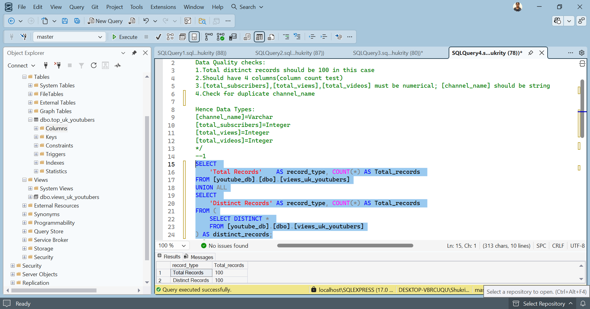
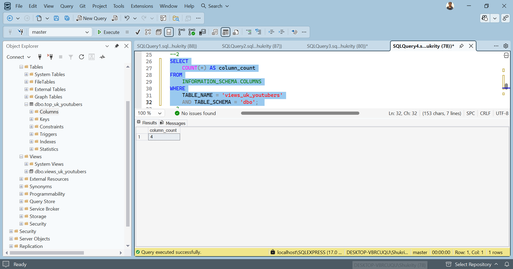
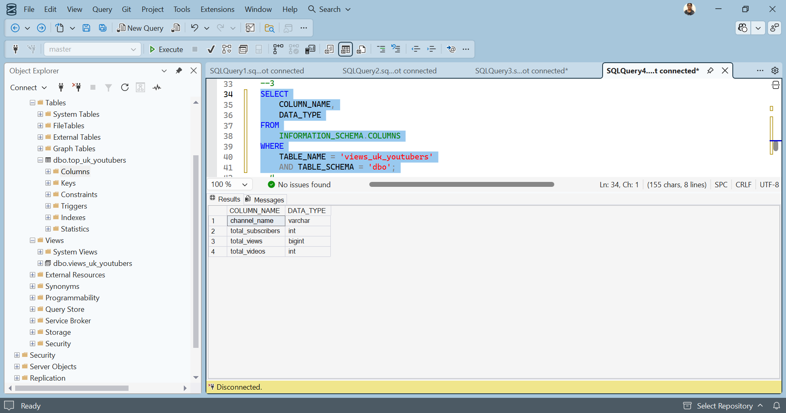
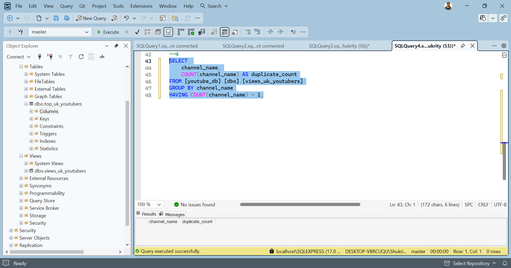
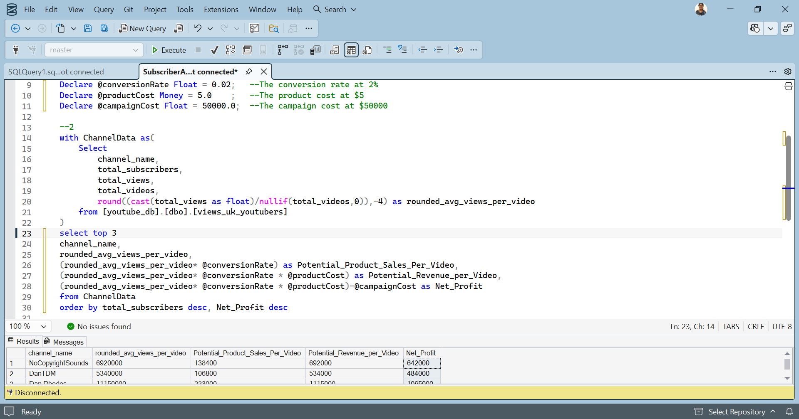

# 📊 Top UK YouTubers 2024 — Data Analytics Portfolio
> **From Raw Kaggle Data → SQL Cleaning → Power BI Dashboard → Marketing ROI Insights**


[](https://www.microsoft.com/en-us/sql-server)
[](https://powerbi.microsoft.com/)
[](https://www.microsoft.com/en-us/microsoft-365/excel)
[](https://github.com/)

---

## 📁 Table of Contents

- [Objective](#-objective)
- [User Story](#-user-story)
- [Data Source](#-data-source)
- [Project Stages](#-project-stages)
- [Design](#-design)
  - [Dashboard Mockup](#dashboard-mockup)
  - [Tools Used](#tools-used)
- [Development](#-development)
  - [Pseudocode](#pseudocode)
  - [Data Exploration](#data-exploration-notes)
  - [Data Cleaning](#data-cleaning)
  - [SQL Transformation](#transform-the-data)
  - [SQL View](#create-the-sql-view)
- [Testing](#-testing)
  - [Row Count Check](#row-count-check)
  - [Column Count Check](#column-count-check)
  - [Data Type Check](#data-type-check)
  - [Duplicate Check](#duplicate-count-check)
- [Visualization](#-visualization)
  - [Dashboard](#results)
  - [DAX Measures](#dax-measures)
- [Analysis](#-analysis)
  - [Findings](#findings)
  - [Validation & ROI](#validation)
  - [Discoveries](#discovery)
- [Recommendations](#-recommendations)
  - [Potential ROI](#potential-roi)
  - [Action Plan](#action-plan)
- [Conclusion](#-conclusion)

---

## 🎯 Objective

### The Business Problem

The **Head of Marketing** needs to identify the best UK YouTubers for marketing campaign partnerships throughout 2024. With hundreds of channels to evaluate, data-driven insights are essential to avoid costly collaborations with underperforming creators.

### The Solution

An interactive Power BI dashboard surfacing key metrics for the **Top 100 UK YouTubers**, enabling the marketing team to:

| Metric | Why It Matters |
|---|---|
| Subscriber Count | Indicates audience size and brand reach |
| Total Views | Reflects cumulative content performance |
| Total Videos | Shows consistency and publishing frequency |
| Engagement Rate | Measures audience interaction quality |

> 🏁 **End Goal:** Equip the marketing team with a reliable, visual decision-making tool to maximize campaign ROI.

---

## 👤 User Story

> *"As the Head of Marketing, I want a dashboard that analyses YouTube channel data in the UK so I can identify the top-performing channels by subscriber base and average views — helping me make smarter collaboration decisions to maximize each campaign's effectiveness."*

---

## 📦 Data Source

- **Dataset:** [Top 100 Social Media Influencers 2024 — Countrywise](https://www.kaggle.com/datasets/bhavyadhingra00020/top-100-social-media-influencers-2024-countrywise?resource=download) (Kaggle)
- **Format:** Excel extract (`.xlsx`)
- **Scope:** UK YouTubers only

### Required Fields

```
✅ channel_name        — YouTube channel identifier
✅ total_subscribers   — Total subscriber count
✅ total_views         — Cumulative view count
✅ total_videos        — Number of uploaded videos
```

---

## 🗂 Project Stages

```
1. Design      →   Define requirements & dashboard wireframe
2. Development →   Clean, transform & model the data in SQL
3. Testing     →   Validate data quality with SQL checks
4. Analysis    →   Derive insights & calculate ROI scenarios
```

---

## 🎨 Design

### Dashboard Components

Based on stakeholder requirements, the dashboard needs to answer:

1. 🏆 Who are the **Top 10 YouTubers** by subscriber count?
2. 📹 Which **3 channels** have uploaded the **most videos**?
3. 👁️ Which **3 channels** have the **most total views**?
4. 📈 Which **3 channels** have the **highest average views per video**?
5. 🔗 Which **3 channels** have the **highest views-per-subscriber ratio**?
6. 💬 Which **3 channels** have the **highest subscriber engagement rate** per video?

### Visuals Selected

| Visual Type | Purpose |
|---|---|
| Table | Ranked channel comparisons |
| Treemap | Relative subscriber/view size |
| Scorecards | KPI summary at a glance |
| Horizontal Bar Chart | Side-by-side metric ranking |

---

### Tools Used

| Tool | Purpose |
|---|---|
|  | Initial data exploration |
|  | Data cleaning, testing & transformation |
|  | Interactive dashboard & visualization |
|  | Version control & project documentation |
|  | Dashboard wireframe design |

---

## 🛠 Development

### Pseudocode

High-level workflow for this project:

```
1.  Obtain raw dataset from Kaggle
2.  Explore data structure in Excel
3.  Load data into SQL Server
4.  Clean & transform data using SQL
5.  Run data quality tests
6.  Build Power BI dashboard connected to SQL view
7.  Generate analytical findings
8.  Document insights & recommendations
9.  Publish to GitHub
```

---

### Data Exploration Notes

Initial observations from the raw dataset:

| # | Observation | Action Required |
|---|---|---|
| 1 | 4 core columns contain all required data | No additional data needed from client |
| 2 | Column 1 contains channel ID + name separated by `@` | Extract channel name using `SUBSTRING` + `CHARINDEX` |
| 3 | Some cells/headers are in a foreign language | Confirm relevance; address or drop |
| 4 | Dataset contains more columns than needed | Drop irrelevant columns in transformation |

---

### Data Cleaning

**Target Schema — Clean Dataset:**

| Property | Value |
|---|---|
| Rows | 100 |
| Columns | 4 |
| Nulls Allowed | None |

**Column Specifications:**

| Column Name | Data Type | Nullable |
|---|---|---|
| `channel_name` | `VARCHAR(100)` | ❌ NO |
| `total_subscribers` | `INTEGER` | ❌ NO |
| `total_views` | `INTEGER` | ❌ NO |
| `total_videos` | `INTEGER` | ❌ NO |

**Cleaning Steps:**
1. Remove unnecessary columns — select only the 4 required fields
2. Extract channel name from the `NOMBRE` column using string functions
3. Rename columns with clear, consistent aliases

---

### Transform the Data

```sql
/*
  # Data Transformation
  # 1. Select only required columns
  # 2. Extract channel name from the 'NOMBRE' column (format: "ChannelName@handle")
*/

SELECT
    SUBSTRING(NOMBRE, 1, CHARINDEX('@', NOMBRE) - 1) AS channel_name,  -- Extract name before '@'
    total_subscribers,
    total_views,
    total_videos
FROM [youtube_db].[dbo].[top_uk_youtubers]
```

---

### Create the SQL View

```sql
/*
  # Create reusable SQL view for Power BI consumption
  # 1. Create view to persist the transformed dataset
  # 2. Cast channel name as VARCHAR(100)
  # 3. Pull required columns from source table
*/

CREATE VIEW 
views_uk_youtubers AS
SELECT
    SUBSTRING(NOMBRE, 1, CHARINDEX('@', NOMBRE) - 1) AS channel_name,  -- Extract name before '@'
    total_subscribers,
    total_views,
    total_videos
FROM [youtube_db].[dbo].[top_uk_youtubers];
```

---

## 🧪 Testing

### Data Quality Tests

#### Row Count Check

```sql
-- Validate: Expect 100 rows
SELECT 
    'Total Records'    AS record_type, COUNT(*) AS Total_records 
FROM [youtube_db].[dbo].[views_uk_youtubers]
UNION ALL
SELECT 
    'Distinct Records' AS record_type, COUNT(*) AS Total_records 
FROM (
    SELECT DISTINCT * 
    FROM [youtube_db].[dbo].[views_uk_youtubers]
) AS distinct_records;
```



---

#### Column Count Check

```sql
-- Validate: Expect 4 columns
SELECT
    COUNT(*) AS column_count
FROM
    INFORMATION_SCHEMA.COLUMNS
WHERE
    TABLE_NAME = 'views_uk_youtubers'
    AND TABLE_SCHEMA = 'dbo';  
```



---

#### Data Type Check

```sql
-- Validate: Ensure correct data types for each column
SELECT
    COLUMN_NAME,
    DATA_TYPE
FROM
    INFORMATION_SCHEMA.COLUMNS
WHERE
    TABLE_NAME = 'views_uk_youtubers'
    AND TABLE_SCHEMA = 'dbo'; 
```



---

#### Duplicate Count Check

```sql
-- Validate: No duplicate channel names
SELECT 
    channel_name,
    COUNT(channel_name) AS duplicate_count
FROM [youtube_db].[dbo].[views_uk_youtubers]
GROUP BY channel_name
HAVING COUNT(channel_name) > 1;
```



> ✅ **All quality checks passed** — dataset is clean and ready for visualization.

---

## 📊 Visualization

### Results


The dashboard provides an at-a-glance view of the Top UK YouTubers, with dynamic filtering across all key metrics.

---

### DAX Measures

#### 1. Total Subscribers (M)
```dax
Total Subscribers (M) = 
VAR million = 1000000
VAR sumOfSubscribers = SUM(view_uk_youtubers_2024[total_subscribers])
VAR totalSubscribers = DIVIDE(sumOfSubscribers, million)
RETURN totalSubscribers
```

#### 2. Total Views (B)
```dax
Total Views (B) = 
VAR billion = 1000000000
VAR sumOfTotalViews = SUM(view_uk_youtubers_2024[total_views])
VAR totalViews = ROUND(sumOfTotalViews / billion, 2)
RETURN totalViews
```

#### 3. Total Videos
```dax
Total Videos = 
VAR totalVideos = SUM(view_uk_youtubers_2024[total_videos])
RETURN totalVideos
```

#### 4. Average Views Per Video (M)
```dax
Average Views per Video (M) = 
VAR sumOfTotalViews = SUM(view_uk_youtubers_2024[total_views])
VAR sumOfTotalVideos = SUM(view_uk_youtubers_2024[total_videos])
VAR avgViewsPerVideo = DIVIDE(sumOfTotalViews, sumOfTotalVideos, BLANK())
VAR finalAvgViewsPerVideo = DIVIDE(avgViewsPerVideo, 1000000, BLANK())
RETURN finalAvgViewsPerVideo
```

#### 5. Subscriber Engagement Rate
```dax
Subscriber Engagement Rate = 
VAR sumOfTotalSubscribers = SUM(view_uk_youtubers_2024[total_subscribers])
VAR sumOfTotalVideos = SUM(view_uk_youtubers_2024[total_videos])
VAR subscriberEngRate = DIVIDE(sumOfTotalSubscribers, sumOfTotalVideos, BLANK())
RETURN subscriberEngRate
```

#### 6. Views Per Subscriber
```dax
Views Per Subscriber = 
VAR sumOfTotalViews = SUM(view_uk_youtubers_2024[total_views])
VAR sumOfTotalSubscribers = SUM(view_uk_youtubers_2024[total_subscribers])
VAR viewsPerSubscriber = DIVIDE(sumOfTotalViews, sumOfTotalSubscribers, BLANK())
RETURN viewsPerSubscriber
```

---

## 🔍 Analysis

### Findings

> Focused on metrics most relevant to marketing ROI: **subscribers**, **total views**, and **upload consistency**.

#### 1. Top 10 YouTubers by Subscribers

| Rank | Channel | Subscribers (M) |
|------|---------|----------------|
| 🥇 1 | NoCopyrightSounds | 33.60 |
| 🥈 2 | DanTDM | 28.60 |
| 🥉 3 | Dan Rhodes | 26.50 |
| 4 | Miss Katy | 24.50 |
| 5 | Mister Max | 24.40 |
| 6 | KSI | 24.10 |
| 7 | Jelly | 23.50 |
| 8 | Dua Lipa | 23.30 |
| 9 | Sidemen | 21.00 |
| 10 | Ali-A | 18.90 |

#### 2. Top 3 Channels by Videos Uploaded

| Rank | Channel | Videos Uploaded |
|------|---------|----------------|
| 1 | GRM Daily | 14,696 |
| 2 | Manchester City | 8,248 |
| 3 | Yogscast | 6,435 |

#### 3. Top 3 Channels by Total Views

| Rank | Channel | Total Views (B) |
|------|---------|----------------|
| 1 | DanTDM | 19.78 |
| 2 | Dan Rhodes | 18.56 |
| 3 | Mister Max | 15.97 |

#### 4. Top 3 Channels by Average Views Per Video

| Rank | Channel | Avg Views/Video (M) |
|------|---------|-------------------|
| 1 | Mark Ronson | 32.27 |
| 2 | Jessie J | 5.97 |
| 3 | Dua Lipa | 5.76 |

#### 5. Top 3 Channels by Views Per Subscriber

| Rank | Channel | Views per Subscriber |
|------|---------|---------------------|
| 1 | GRM Daily | 1,185.79 |
| 2 | Nickelodeon | 1,061.04 |
| 3 | Disney Junior UK | 1,031.97 |

#### 6. Top 3 Channels by Subscriber Engagement Rate

| Rank | Channel | Engagement Rate |
|------|---------|----------------|
| 1 | Mark Ronson | 343,000 |
| 2 | Jessie J | 110,416.67 |
| 3 | Dua Lipa | 104,954.95 |

---

### Validation

#### Campaign 1 — Product Placement (Most Subscribers)

*Assumptions: Product cost = $5 | Conversion rate = 2% | One-time campaign fee = $50,000*

| Channel | Avg Views/Video | Potential Revenue | Campaign Cost | **Net Profit** |
|---------|----------------|------------------|--------------|----------------|
| NoCopyrightSounds | 6.92M | $692,000 | $50,000 | **$642,000** |
| DanTDM | 5.34M | $534,000 | $50,000 | **$484,000** |
| Dan Rhodes | 11.15M | $1,115,000 | $50,000 | **$1,065,000** ✅ |

> 🏆 **Best pick: Dan Rhodes** — highest net profit at $1,065,000 per video

```sql
/*
1.Define the variables
2.Create CTE that rounds the average views per video
3.Select the columns that are required for the analysis
4.Filter the results by the YouTube channels with the highest subscriber bases
5.Order by net_profit(from highest to lowest)
*/
--1
Declare @conversionRate Float = 0.02;	--The conversion rate at 2%
Declare @productCost Money = 5.0	;	--The product cost at $5
Declare @campaignCost Float = 50000.0;	--The campaign cost at $50000

--2
with ChannelData as(
	Select
		channel_name,
		total_subscribers,
		total_views,
		total_videos,
		round((cast(total_views as float)/nullif(total_videos,0)),-4) as rounded_avg_views_per_video
	from [youtube_db].[dbo].[views_uk_youtubers]
)
select top 3 
channel_name,
rounded_avg_views_per_video,
(rounded_avg_views_per_video* @conversionRate) as Potential_Product_Sales_Per_Video,
(rounded_avg_views_per_video* @conversionRate * @productCost) as Potential_Revenue_per_Video,
(rounded_avg_views_per_video* @conversionRate * @productCost)-@campaignCost as Net_Profit
from ChannelData 
order by total_subscribers desc, Net_Profit desc
```



---

#### Campaign 2 — Sponsored Video Series (Most Videos Uploaded)

*Assumptions: Product cost = $5 | Conversion rate = 2% | $5,000/video × 11 videos = $55,000*

| Channel | Avg Views/Video | Potential Revenue | Campaign Cost | **Net Profit** |
|---------|----------------|------------------|--------------|----------------|
| GRM Daily | 510K | $51,000 | $55,000 | **-$4,000** ❌ |
| Manchester City | 240K | $24,000 | $55,000 | **-$31,000** ❌ |
| Yogscast | 710K | $71,000 | $55,000 | **$16,000** ✅ |

> 🏆 **Best pick: Yogscast** — only channel with positive ROI in this category

```sql
DECLARE @conversionRate FLOAT = 0.02;
DECLARE @productCost FLOAT = 5.0;
DECLARE @campaignCostPerVideo FLOAT = 5000.0;
DECLARE @numberOfVideos INT = 11;

WITH ChannelData AS (
    SELECT
        channel_name,
        total_views,
        total_videos,
        ROUND((CAST(total_views AS FLOAT) / total_videos), -4) AS rounded_avg_views_per_video
    FROM [youtube_db].[dbo].[views_uk_youtubers]
)
SELECT
    channel_name,
    rounded_avg_views_per_video,
    (rounded_avg_views_per_video * @conversionRate)                                                             AS potential_units_sold_per_video,
    (rounded_avg_views_per_video * @conversionRate * @productCost)                                              AS potential_revenue_per_video,
    ((rounded_avg_views_per_video * @conversionRate * @productCost) - (@campaignCostPerVideo * @numberOfVideos)) AS net_profit
FROM ChannelData
WHERE channel_name IN ('GRM Daily', 'Man City', 'YOGSCAST Lewis & Simon ')
ORDER BY net_profit DESC;
```


---

#### Campaign 3 — Influencer Marketing Contract (Most Views)

*Assumptions: Product cost = $5 | Conversion rate = 2% | 3-month contract = $130,000*

| Channel | Avg Views/Video | Potential Revenue | Campaign Cost | **Net Profit** |
|---------|----------------|------------------|--------------|----------------|
| DanTDM | 5.34M | $534,000 | $130,000 | **$404,000** |
| Dan Rhodes | 11.15M | $1,115,000 | $130,000 | **$985,000** |
| Mister Max | 14.06M | $1,406,000 | $130,000 | **$1,276,000** ✅ |

> 🏆 **Best pick: Mister Max** — highest net profit at $1,276,000 per video

```sql
DECLARE @conversionRate FLOAT = 0.02;
DECLARE @productCost MONEY = 5.0;
DECLARE @campaignCost MONEY = 130000.0;

WITH ChannelData AS (
    SELECT
        channel_name,
        total_views,
        total_videos,
        ROUND(CAST(total_views AS FLOAT) / total_videos, -4) AS avg_views_per_video
    FROM [youtube_db].[dbo].[views_uk_youtubers]
)
SELECT
    channel_name,
    avg_views_per_video,
    (avg_views_per_video * @conversionRate)                              AS potential_units_sold_per_video,
    (avg_views_per_video * @conversionRate * @productCost)               AS potential_revenue_per_video,
    (avg_views_per_video * @conversionRate * @productCost) - @campaignCost AS net_profit
FROM ChannelData
WHERE channel_name IN ('Mister Max', 'DanTDM', 'Dan Rhodes')
ORDER BY net_profit DESC;
```


---

### Discovery

Key takeaways from the analysis:

1. **NoCopyrightSounds, Dan Rhodes, and DanTDM** lead in UK subscriber counts — strong brand awareness plays
2. **GRM Daily, Man City, and Yogscast** are the highest-volume publishers, but average views per video are relatively low — volume alone doesn't guarantee ROI
3. **DanTDM, Dan Rhodes, and Mister Max** dominate total view counts — best for maximum reach campaigns
4. **Entertainment and music channels** consistently outperform others in engagement, making them the strongest long-term partnership candidates

---

## 💡 Recommendations

### Strategic Guidance

| Priority | Channel | Campaign Type | Rationale |
|----------|---------|--------------|-----------|
| ⭐ Primary | **Dan Rhodes** | Product Placement | Highest subscribers + strong avg views |
| ⭐ Primary | **Mister Max** | Influencer Contract | Best net profit for view-based campaigns |
| ✅ Secondary | **DanTDM** | Either format | Consistent performer; large loyal fanbase |
| ✅ Secondary | **NoCopyrightSounds** | Product Placement | $642K/video net profit — worth considering |
| ⚠️ Caution | GRM Daily / Man City | Sponsored Series | Negative ROI under current budget caps |

### Potential ROI

| Channel | Campaign | Estimated Net Profit |
|---------|----------|---------------------|
| Dan Rhodes | Product Placement | **$1,065,000/video** |
| Mister Max | Influencer Contract | **$1,276,000/video** |
| DanTDM | Product Placement | **$484,000/video** |
| DanTDM | Influencer Contract | **$404,000/video** |
| NoCopyrightSounds | Product Placement | **$642,000/video** |

### Action Plan

```
Step 1 → Initiate outreach to Dan Rhodes team (primary partnership)
Step 2 → Negotiate contract within approved marketing budget
Step 3 → Launch campaign and track KPIs (views, CTR, conversions)
Step 4 → Review performance at 30/60/90-day milestones
Step 5 → Scale to DanTDM, Mister Max & NoCopyrightSounds based on results
```

---

## 🏁 Conclusion

This project demonstrates a full end-to-end data analytics workflow — from raw data ingestion through to actionable business recommendations. By combining **SQL for data engineering**, **Power BI for visualization**, and **structured ROI analysis**, the marketing team now has a clear, evidence-based framework for making YouTuber collaboration decisions in 2024.

**The top 3 recommended channels for partnership:**

| # | Channel | Why |
|---|---------|-----|
| 1 | **Dan Rhodes** | Best overall subscriber base + strong per-video ROI |
| 2 | **Mister Max** | Highest projected influencer campaign returns |
| 3 | **DanTDM** | Loyal audience + consistent long-term performer |

---

<p align="center">
  <i>Built with SQL Server · Power BI · Excel · GitHub</i><br/>
  <i>Data sourced from <a href="https://www.kaggle.com/datasets/bhavyadhingra00020/top-100-social-media-influencers-2024-countrywise">Kaggle</a></i>
</p>
